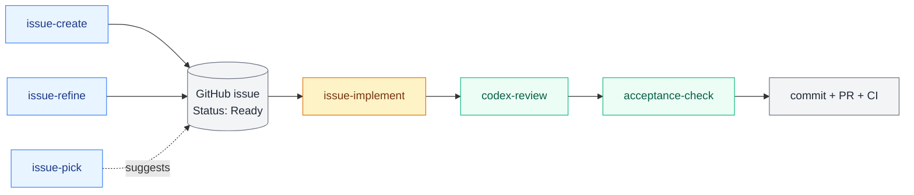

<div align="center">

# 🧷 issuekit

### _Issue-driven development for AI coding agents._

A Claude Code skill bundle that treats each GitHub issue as the canonical "rich plan" for a unit of work — so volatile specs stay out of your repository and only durable code gets versioned.

[](./LICENSE)
[](https://skills.sh)
[](https://docs.claude.com/en/docs/claude-code)

</div>

---

> [!NOTE]
> **Japanese-oriented plugin.** Skill bodies, descriptions, and this README are written in English, but the skills read Japanese section headers (e.g. `## 受け入れ条件`) hardcoded into issue bodies. Issue contents themselves are expected to remain in Japanese. To use issuekit with English-only issues, you will currently need to fork and adjust the hardcoded keywords.

> [!IMPORTANT]
> **Casual OSS.** No SLA, no response guarantees. Distributed as-is for users who share the underlying philosophy. PRs and issues are welcome but may be closed without action if they conflict with the maintainer's solo-dev workflow.

## Table of Contents

- [💡 Philosophy](#-philosophy)
- [🆚 Comparison with related frameworks](#-comparison-with-related-frameworks)
- [🧩 Skills](#-skills)
- [🔁 Workflow](#-workflow)
- [🛠️ Dependencies](#-dependencies)
- [📦 Install](#-install)
- [📄 License](#-license)

---

## 💡 Philosophy

Most "spec-driven" or "plan-driven" frameworks for AI coding agents store the spec **in the repository** as markdown files (`spec.md`, `plan.md`, etc.) checked in alongside the code. issuekit takes a different position:

- **Specs and plans are volatile.** They describe a single unit of intent. Once the work is merged, the plan is dead — what survives is the code, the test, and (if anything) a one-line commit message.
- **Versioning volatile artifacts in git is friction.** A merged plan rots in the repo, gets stale, and pollutes diffs and search.
- **GitHub issues are already a versioned, queryable, time-bounded plan store.** They have state (`open` / `closed`), threading, references, and a natural lifecycle that matches the work itself.

So issuekit treats the **GitHub issue as the rich plan** for the work, and the repository contains only the durable artifacts (code, tests, configs). When the issue is closed, the plan disappears from the active surface area — exactly as intended.

This is opinionated. issuekit will not be a good fit if you want plans to live next to the code, or if your team's workflow expects spec markdown checked in.

---

## 🆚 Comparison with related frameworks

issuekit shares one core idea with Spec Kit, cc-spex, and superpowers: **make the "what" an explicit contract that an AI agent can read, follow, and be checked against.** Where they differ is _where_ that contract lives, and how compliance is verified.

| Framework                                          | Contract location                                           | Verification model                                                                                    | Fit                                                 |
| -------------------------------------------------- | ----------------------------------------------------------- | ----------------------------------------------------------------------------------------------------- | --------------------------------------------------- |
| [Spec Kit](https://github.com/github/spec-kit)     | Spec markdown checked into the repo                         | Agent re-reads the spec                                                                               | Teams that want specs versioned alongside code      |
| [cc-spex](https://github.com/rhuss/cc-spex)        | Spec markdown checked into the repo                         | Agent re-reads the spec                                                                               | Solo / small team, lighter than Spec Kit            |
| [superpowers](https://github.com/obra/superpowers) | Skill bundle of general-purpose engineering workflows       | Skill conventions + agent judgment                                                                    | Broad augmentation of Claude Code; not spec-centric |
| **issuekit**                                       | GitHub issue body (`## 受け入れ条件`, `## スコープ外`, ...) | `acceptance-check` skill mechanically verifies each acceptance criterion as `✓ / ✗ / ?` before commit | Solo dev who already runs an issue-first workflow   |

The differentiator that matters most to issuekit's design is the **verification model**. Detailed specs help agents stay on-rails, but spec compliance is itself a problem: the longer the spec, the more places the agent can drift. issuekit's response is structural rather than prescriptive — instead of writing more spec, write fewer but **mechanically verifiable** acceptance criteria, and have a dedicated skill (`acceptance-check`) check them before commit. The spec stays small; the verification stays honest.

---

## 🧩 Skills

issuekit ships six Claude Code skills under `skills/`:

| Skill                | Role        | Description                                                                                                                                            |
| -------------------- | ----------- | ------------------------------------------------------------------------------------------------------------------------------------------------------ |
| `issue-create`       | Entry point | Open a new GitHub issue using issuekit's standard format (`Status: Ready` / `Status: Draft` header, intent, plan, acceptance criteria, out-of-scope).  |
| `issue-refine`       | Entry point | Re-shape an existing issue (title-only or partially formatted) into the standard format.                                                               |
| `issue-pick`         | Entry point | Read-only triage: from a set of open issues, suggest the next one to take on, with rationale.                                                          |
| `issue-implement`    | Orchestrator| Drive the full cycle from an issue number: status check → implementation → cross-review → acceptance check → commit → PR → CI.                         |
| `acceptance-check`   | Verifier    | Read-only verifier that extracts `## 受け入れ条件` from an issue body and reports each item as `✓ / ✗ / ?`. Called by `issue-implement` before commit. |
| `codex-review`       | Verifier    | Delegate a second-opinion code review to the Codex CLI before opening a PR. Called by `issue-implement` after implementation.                          |

`issue-implement` is the orchestrator; the other skills are either entry points or verifiers it calls.

---

## 🔁 Workflow

The skills compose into a single issue-driven cycle. Entry points feed an issue into the orchestrator, which calls the verifiers before producing a commit and a PR.



---

## 🛠️ Dependencies

issuekit assumes the following tools are available on the host:

- **[Claude Code](https://docs.claude.com/en/docs/claude-code)** — the agent runtime that loads the skills.
- **[`gh` CLI](https://cli.github.com/)** — used for all GitHub interactions (issue read/write, PR creation, CI status).
- **[Codex CLI](https://github.com/openai/codex)** — used by `codex-review` to obtain a cross-review from a different model. Install with `brew install --cask codex` (or the equivalent for your platform).

`gh` must be authenticated against the repository you want to operate on. Codex CLI must be reachable on `PATH`; if it is not installed, `codex-review` will fail explicitly rather than silently skipping the review.

---

## 📦 Install

issuekit is distributed via [skills.sh](https://skills.sh) ([vercel-labs/skills](https://github.com/vercel-labs/skills)).

```bash
# Install all six skills
npx skills add hirokisakabe/issuekit

# Or install a specific skill only
npx skills add hirokisakabe/issuekit --skill issue-implement
```

This installs the skills under your agent's skill directory (e.g. `~/.claude/skills/` for Claude Code). See [skills.sh](https://skills.sh) for the list of supported agents (Claude Code, Codex CLI, Cursor, Gemini, ...).

---

## 📄 License

[MIT](./LICENSE)
