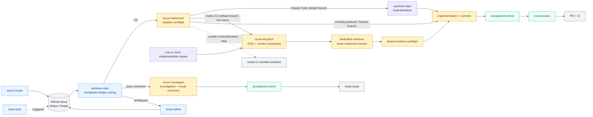

<div align="center">

# 🧷 issuekit

### _Issue-driven development for AI coding agents._

An Agent Skills bundle that treats each GitHub issue as the canonical "rich plan" for a unit of work — so volatile specs stay out of your repository and only durable code gets versioned.

[](./LICENSE)
[](https://skills.sh)
[](https://skills.sh)

</div>

---

> [!NOTE]
> **Japanese-oriented plugin.** Skill bodies, descriptions, and this README are written in English, but the skills read Japanese section headers (e.g. `## 受け入れ条件`) hardcoded into issue bodies. Issue contents themselves are expected to remain in Japanese. To use issuekit with English-only issues, you will currently need to fork and adjust the hardcoded keywords.

> [!IMPORTANT]
> **Casual OSS.** No SLA, no response guarantees. Distributed as-is for users who share the underlying philosophy. PRs and issues are welcome but may be closed without action if they conflict with the maintainer's solo-dev workflow.

## Table of Contents

- [📦 Install](#-install)
- [🛠️ Dependencies](#-dependencies)
- [🧩 Skills](#-skills)
- [🌳 Worktree isolation](#-worktree-isolation)
- [🚦 Issue dispatch](#-issue-dispatch)
- [🔁 Workflow](#-workflow)
- [💡 Philosophy](#-philosophy)
- [🆚 Comparison with related frameworks](#-comparison-with-related-frameworks)
- [📄 License](#-license)

---

## 📦 Install

### via `gh skill` (recommended — supports version pinning)

```bash
# Install a skill interactively (choose from the list)
gh skill install hirokisakabe/issuekit

# Install a specific skill (e.g. issue-implement)
gh skill install hirokisakabe/issuekit issue-implement

# Pin to a specific version
gh skill install hirokisakabe/issuekit issue-implement@v1.0.0

# Or use the --pin flag
gh skill install hirokisakabe/issuekit issue-implement --pin v1.0.0

# Install for Claude Code at user scope explicitly
gh skill install hirokisakabe/issuekit issue-implement --agent claude-code --scope user
```

The install location depends on `--agent` and `--scope`; for Claude Code at user scope, skills land in `~/.claude/skills/`. Version tags follow [GitHub Releases](https://github.com/hirokisakabe/issuekit/releases).

### via `npx skills` (Claude Code, Codex CLI, Cursor, Gemini, …)

```bash
# Install all nine skills (always installs HEAD — version pinning not yet supported)
npx skills add hirokisakabe/issuekit

# Or install a specific skill only
npx skills add hirokisakabe/issuekit --skill issue-implement
```

This installs the skills under your agent's skill directory (e.g. `~/.claude/skills/` for Claude Code). See [skills.sh](https://skills.sh) for the list of supported agents (Claude Code, Codex CLI, Cursor, Gemini, ...).

---

## 🛠️ Dependencies

issuekit assumes the following tools are available on the host:

- **An [Agent Skills](https://docs.claude.com/en/docs/agents-and-tools/agent-skills/overview)-compatible agent runtime** (e.g. [Claude Code](https://docs.claude.com/en/docs/claude-code), Codex CLI, Cursor) that loads the skills. The full `issue-implement` cycle currently requires Codex CLI or Claude Code because `cross-review` has reviewer-session launch steps only for those runtimes.
- **[`gh` CLI](https://cli.github.com/)** — used for all GitHub interactions (issue read/write, PR creation, CI status).
- **The CLI for your current agent runtime** — required by `cross-review` to start an independent reviewer session:
  - **[Codex CLI](https://github.com/openai/codex)** (`brew install --cask codex`) when the implementation is driven from Codex CLI.
  - **[Claude CLI](https://docs.claude.com/en/docs/claude-code)** (`npm install -g @anthropic-ai/claude-code`) when the implementation is driven from Claude Code (uses `claude -p` headless mode).
- **Claude Code with `EnterWorktree` support** — required by `worktree-start`. If the tool is unavailable, update Claude Code and restart the session, or start a new isolated session with `claude --worktree <name>`. Other skills load on any Agent Skills-compatible runtime, but `cross-review` currently documents reviewer-session launch steps only for Codex CLI and Claude Code.

`gh` must be authenticated against the repository you want to operate on. `cross-review` does not switch to another backend automatically; it uses the CLI that corresponds to the runtime currently driving the implementation. If that CLI is unavailable, or if the current runtime has no documented reviewer-session launch step, `cross-review` fails explicitly rather than silently skipping the review.

---

## 🧩 Skills

issuekit ships nine skills under `skills/`:

| Skill                | Role        | Description                                                                                                                                            |
| -------------------- | ----------- | ------------------------------------------------------------------------------------------------------------------------------------------------------ |
| `issue-create`       | Entry point | Open a new GitHub issue using issuekit's standard format (`Status: Ready` / `Status: Draft` header, intent, plan, acceptance criteria, out-of-scope).  |
| `issue-refine`       | Entry point | Re-shape an existing issue (title-only or partially formatted) into the standard format.                                                               |
| `issue-pick`         | Entry point | Read-only triage: from a set of open issues, suggest the next one to take on, with rationale.                                                          |
| `worktree-start`     | Entry point | **Claude Code interactive sessions only.** Switch via `EnterWorktree`; reuse an existing linked worktree; route a Ready issue to `issue-implement` (PR), `issue-investigate` (issue comment), or `issue-refine` (ambiguous). |
| `issue-dispatch`     | Orchestrator| Resolve one or more implementation requests, preflight dependencies / conflicts / runtime permissions, then run one worktree-isolated `issue-implement` worker per issue and aggregate PR / CI results. |
| `issue-implement`    | Orchestrator| Guard for PR-shaped work, then drive status check → mandatory isolation preflight → implementation / commits → acceptance check → cross-review → PR → CI. The full cycle currently requires Codex CLI or Claude Code because of `cross-review`. |
| `issue-investigate`  | Orchestrator| Investigate, design, or run a technical spike without durable repo changes; post a structured result comment, run acceptance checks, then close the issue on success. |
| `acceptance-check`   | Verifier    | Read-only verifier that extracts `## 受け入れ条件` and checks repo state or issue comments, reporting each item as `✓ / ✗ / ?`. Called by both orchestrators before completion. |
| `cross-review`       | Verifier    | Start an independent reviewer session with the current runtime's CLI and get a second-opinion code review before PR creation. Called by `issue-implement` after `acceptance-check` passes; review fixes land as additional commits. |

`issue-dispatch`, `issue-implement`, and `issue-investigate` are the three orchestrators. `issue-dispatch` owns cross-issue scheduling and isolation but delegates every issue's implementation cycle to `issue-implement`; PR-shaped work then goes through implementation, review, and CI. Comment-shaped investigation work records its result on the issue and closes it without a commit or PR. `worktree-start` is the only Claude Code-specific entry point, owns only the in-session `EnterWorktree` transition, and routes a Ready issue by its acceptance criteria and out-of-scope section: PR → `issue-implement`, issue comment → `issue-investigate`, ambiguous → `issue-refine`. Codex App managed worktrees and Handoff remain App-owned.

`Status: Draft` is reserved for issues whose acceptance criteria are not yet certain. Draft issues include a `## Ready にするための未決事項` checklist containing the concrete decisions needed to finalize those criteria; implementation-plan choices alone do not make an issue Draft.

---

## 🌳 Worktree isolation

Before `issue-implement` writes files or commits, it classifies the current location as a linked worktree, a non-default feature branch, or the repository's default branch. An existing linked worktree dedicated to the current issue/task is reused without creating another one; a linked worktree assigned to another task, or with unverifiable assignment, is not reused. A single implementation on an existing feature branch is also preserved. A write-capable parallel worker is evaluated first and is stricter: **one worker must have one dedicated worktree**. If exclusive assignment cannot be established from runtime/session context, the worker stops instead of assuming a linked worktree is safe.

[Codex subagent workflows](https://learn.chatgpt.com/docs/agent-configuration/subagents) are available in the CLI, IDE extension, and App, but the current documented subagent contract does not assign a dedicated cwd / worktree to each native subagent. Keep parallel exploration and review read-only where possible. `issue-dispatch` uses ordinary worktrees plus `codex exec -C` for Codex CLI write workers and refuses same-checkout parallel writes when the runtime cannot guarantee isolation.

| Runtime | Isolation contract on the default branch |
| --- | --- |
| Codex CLI | A single `issue-implement` request on the default branch hands the issue to `issue-dispatch`. The parent creates an ordinary worktree and starts one non-interactive worker with [`codex exec -C <path>`](https://learn.chatgpt.com/docs/developer-commands?surface=cli), without migrating its own cwd. |
| Codex App | Start the chat in an App-managed **Worktree**, or use **Handoff** from Local to Worktree. These are App-owned features; issuekit does not create or control managed worktrees. See [Codex Worktrees](https://learn.chatgpt.com/docs/environments/git-worktrees). |
| Claude Code CLI | Start isolated with `claude --worktree <name>`, or let `worktree-start` use `EnterWorktree` from an interactive session. See [Claude Code worktrees](https://code.claude.com/docs/en/worktrees). |
| Claude Code subagent | Set `isolation: worktree` in the agent frontmatter or spawn configuration. See [Claude Code subagents](https://code.claude.com/docs/en/sub-agents). |
| Claude Code Agent view | Background sessions move into isolated worktrees before editing unless isolation is explicitly disabled. See [Agent view](https://code.claude.com/docs/en/agent-view#how-file-edits-are-isolated). |
| Claude Desktop Code session | New sessions receive automatic worktrees; lifecycle remains Desktop-owned. See [Claude Desktop](https://code.claude.com/docs/en/desktop#work-in-parallel-with-sessions). |

A worktree is a fresh checkout. Install dependencies and initialize the environment in each worktree as needed; dependencies and build caches can multiply disk usage. If ignored local files such as `.env` or `.env.local` are required, add a repository-root `.worktreeinclude` using `.gitignore` syntax. Only ignored files are copied by Codex App managed worktrees and Claude Code-created worktrees; ordinary `git worktree add` does not process this file. Keep secrets within the same trust boundary and do not list tracked files.

---

## 🚦 Issue dispatch

`issue-dispatch` accepts a single issue URL / number, an explicit list, or a bounded selection request such as “up to five Ready refactoring issues.” It refreshes every candidate's body and comments, excludes Draft or contradictory issues, resolves `Depends on:` as a DAG, reads parent-issue context, and estimates overlapping paths before any worker starts. Its launch plan records the issue, title, dependencies, expected paths, parallel group, and dedicated worktree / branch.

Multiple-issue runs default to three concurrent workers. The effective limit is the minimum of that default (or the user's explicit limit), the runtime's worker limit, and the number of independent Ready issues. A failed worker blocks only its dependents; unrelated workers continue. Dependency and high-conflict serial barriers wait for the earlier issue to close and land on the default branch, because a successful but unmerged PR is not a safe base for a separate issue PR.

Runtime behavior is deliberately asymmetric:

- **Codex CLI:** the parent creates one ordinary worktree per issue and launches `codex exec -C <path>` with `workspace-write`, non-interactive approval behavior, and write access limited to that worktree plus the repository's shared git metadata. Each worker runs `issue-implement <N>` through PR and CI.
- **Claude Code:** use a subagent with `isolation: worktree`, Agent view's worktree-isolated background session, or an equivalent official isolation primitive. Do not use non-isolated Agent teams for write workers.
- **Codex App:** top-level Worktree chats and Handoff are App-owned. When the current surface cannot create one isolated chat per issue, the skill returns the worktree plan and per-issue launch prompts instead of automating the UI.

`issue-pick` remains read-only and never auto-chains into dispatch. Dispatch starts only from an explicit implementation request.

---

## 🔁 Workflow

The skills compose into PR and issue-comment completion paths. A single Codex CLI implementation invoked on the default branch routes through `issue-dispatch`; explicit multi-issue requests enter the dispatcher directly.


```mermaid
flowchart LR
    A[issue-create] --> I[(GitHub issue<br/>Status: Ready)]
    R[issue-refine] --> I
    P[issue-pick] -. suggests .-> I
    M[one or more implementation issues] --> D[issue-dispatch<br/>DAG + conflict scheduling]
    I --> W[worktree-start<br/>completion-shape routing]
    W -->|PR| PF[issue-implement<br/>isolation preflight]
    W -->|issue comment| INV[issue-investigate<br/>investigation + result comment]
    W -->|ambiguous| R
    PF -->|Claude Code default branch| WT[worktree-start<br/>EnterWorktree]
    PF -->|Codex CLI default branch, one issue| D
    D --> WK[dedicated worktree<br/>issue-implement worker]
    WK --> PFW[linked-worktree preflight]
    PFW --> IMPL
    WT --> IMPL[implementation + commits]
    PF -->|existing worktree / feature branch| IMPL
    PF -. unsafe runtime/location: stop .-> STOP[restart in isolated worktree]
    IMPL --> AC[acceptance-check]
    AC --> CR[cross-review]
    CR --> C[PR + CI]
    INV --> AC2[acceptance-check]
    AC2 --> IC[close issue]

    classDef entry fill:#e8f4ff,stroke:#3b82f6,color:#1e3a8a
    classDef orch  fill:#fef3c7,stroke:#d97706,color:#78350f
    classDef ver   fill:#ecfdf5,stroke:#10b981,color:#065f46
    classDef out   fill:#f3f4f6,stroke:#6b7280,color:#1f2937

    class A,R,P,W entry
    class D,PF,PFW,WK,IMPL,INV orch
    class CR,AC,AC2 ver
    class I,C,IC,STOP out
```

---

## 💡 Philosophy

Most "spec-driven" or "plan-driven" frameworks for AI coding agents store the spec **in the repository** as markdown files (`spec.md`, `plan.md`, etc.) checked in alongside the code. issuekit takes a different position:

- **Specs and plans are volatile.** They describe a single unit of intent. Once the work is merged, the plan is dead — what survives is the code, the test, and (if anything) a one-line commit message.
- **Versioning volatile artifacts in git is friction.** A merged plan rots in the repo, gets stale, and pollutes diffs and search.
- **GitHub issues are already a versioned, queryable, time-bounded plan store.** They have state (`open` / `closed`), threading, references, and a natural lifecycle that matches the work itself.

So issuekit treats the **GitHub issue as the rich plan** for the work, and the repository contains only durable artifacts (code, tests, configs, and explicitly required long-lived documentation). Investigation, design, and spike results default to a structured issue comment; they become repository documents only when the acceptance criteria explicitly require a durable artifact. When the issue is closed, volatile plans and results leave the active surface area — exactly as intended.

This is opinionated. issuekit will not be a good fit if you want plans to live next to the code, or if your team's workflow expects spec markdown checked in.

More precisely, issuekit operates on the **volatile layer** only — each GitHub issue captures a single unit of intent (what to build, acceptance criteria, scope boundary). That plan expires when the issue closes.

The **durable layer** — architecture decisions, domain models, ADRs, and design context that outlives individual issues — is explicitly outside issuekit's scope. Where that knowledge lives (`docs/`, `AGENTS.md`, an external wiki, or nowhere at all) is entirely your call; issuekit neither prescribes nor precludes any arrangement.

---

## 🆚 Comparison with related frameworks

issuekit shares one core idea with Spec Kit, cc-spex, and superpowers: **make the "what" an explicit contract that an AI agent can read, follow, and be checked against.** Where they differ is _where_ that contract lives, and how compliance is verified.

| Framework                                          | Contract location                                           | Verification model                                                                                    | Fit                                                 |
| -------------------------------------------------- | ----------------------------------------------------------- | ----------------------------------------------------------------------------------------------------- | --------------------------------------------------- |
| [Spec Kit](https://github.com/github/spec-kit)     | Spec markdown checked into the repo                         | Agent re-reads the spec                                                                               | Teams that want specs versioned alongside code      |
| [cc-spex](https://github.com/rhuss/cc-spex)        | Spec markdown checked into the repo                         | Agent re-reads the spec                                                                               | Solo / small team, lighter than Spec Kit            |
| [superpowers](https://github.com/obra/superpowers) | Skill bundle of general-purpose engineering workflows       | Skill conventions + agent judgment                                                                    | Broad augmentation of Claude Code; not spec-centric |
| **issuekit**                                       | GitHub issue body and result comments (`## 受け入れ条件`, `## スコープ外`, ...) | `acceptance-check` mechanically verifies each criterion as `✓ / ✗ / ?` before PR creation or issue close | Solo dev who already runs an issue-first workflow   |

The differentiator that matters most to issuekit's design is the **verification model**. Detailed specs help agents stay on-rails, but spec compliance is itself a problem: the longer the spec, the more places the agent can drift. issuekit's response is structural rather than prescriptive — instead of writing more spec, write fewer but **mechanically verifiable** acceptance criteria, and have a dedicated skill (`acceptance-check`) check them before PR creation or issue close. The spec stays small; the verification stays honest.

---

## 📄 License

[MIT](./LICENSE)
